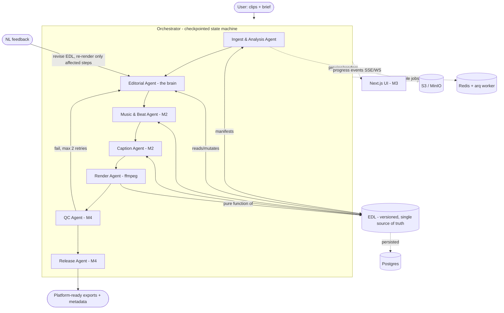

# 🎬 Agentic Video Editor

Raw clips in → publishable video out. Upload 2–20 clips plus a brief; a team of
specialist agents analyzes the footage, plans an edit, and renders a polished cut with
beat-synced cuts, captions, music, and platform-specific export. Human review happens
only at the end.

This repo is built in **milestones**, each independently runnable:

| Milestone | Scope | Status |
|-----------|-------|--------|
| **M1** | Pipeline core: upload → analysis → EDL → ffmpeg rough cut. CLI-triggerable. | ✅ this PR |
| **M2** | Captions + music + beat-sync integrated into the render. | ✅ |
| **M3** | Web UI: upload, progress streaming, preview, timeline, NL feedback + incremental re-render. | ✅ |
| **M4** | QC checks + multi-aspect export + metadata/thumbnail + optional YouTube publish. | ✅ |

> **Development model:** feature-by-feature commits, one milestone per PR. The M3/M4 seams
> (FastAPI app, arq worker, feedback loop, beat-snap module) are already stubbed so later
> milestones slot in without reshaping M1.

---

## Architecture

The system is an **orchestrator + specialist agents** graph. Shared state is the **Edit
Decision List (EDL)** — a versioned JSON document that every agent reads and mutates.
**Rendering is a pure function of the EDL** (same EDL + same assets → identical output),
which is what makes incremental re-rendering and determinism tractable.



### The agents

1. **Ingest & Analysis** — `ffprobe`, mezzanine proxy (H.264 + EBU R128 loudnorm), scene
   detection (PySceneDetect), transcription (WhisperX, word-level + diarization), dead-air
   / filler / blur flags, highlight ranking. Emits one **manifest** per clip. Every heavy
   pass **degrades gracefully** — a missing optional dependency never fails the pipeline.
2. **Editorial** (the brain) — brief + manifests → validated EDL. Removes dead air/filler,
   opens on the strongest hook in the first 3s, keeps narrative continuity, respects target
   length ±tolerance. LLM path (schema-constrained JSON, validate + retry) with a
   **deterministic rule-based fallback** so it runs with zero external services. Every
   segment carries a `reason`.
3. **Music & Beat** (M2) — royalty-free library only; librosa/madmom beat grid + downbeats;
   snap cuts to the nearest beat within tolerance; duck music under dialogue; master to −14
   LUFS. *Snapping policy already implemented & tested in `ave/beat/snap.py`.*
4. **Caption** (M2) — styled karaoke/subtitle captions from word timestamps; burned-in +
   sidecar `.srt`/`.vtt`.
5. **Render** — compiles the EDL into video via an **ffmpeg filtergraph** (chosen over
   Remotion for deterministic, dependency-light concat/xfade + libass captions). Aspect
   variants from one EDL.
6. **QC** (M4) — A/V sync, caption alignment, loudness, black frames, duration; routes
   failures back to the responsible agent (max 2 retries).
7. **Release** (M4) — titles, chaptered description, hashtags, thumbnail candidates; export
   presets; optional YouTube publish (**always requires explicit confirmation**).

---

## The EDL (the data structure to understand first)

Defined canonically in [`backend/ave/edl/schema.py`](backend/ave/edl/schema.py); JSON
Schema is generated with `ave schema`.

```jsonc
{
  "schema_version": "1.0.0",
  "project_id": "proj_ab12cd34ef",
  "version": 4,                       // monotonic; every revision is persisted
  "brief": { "platform": "youtube", "target_duration_s": 480, "tone": "energetic",
             "aspect_ratio": "16:9", "duration_tolerance_pct": 10 },
  "timeline": [
    {
      "id": "seg_01",
      "source_clip": "clip_03",
      "in": 12.48, "out": 19.92,
      "speed": 1.0,
      "transition_in": "hard",
      "cut_snapped_to_beat": true,
      "snapped_beat_s": 12.5,
      "reason": "Strongest hook — 'we almost lost the entire dataset'"
    }
  ],
  "music":   { "track_id": "energetic_128", "offset_s": 0, "ducking": true,
               "duck_db": -14, "sync_map": [ { "beat_s": 0.52, "timeline_s": 0.5, "is_downbeat": true } ] },
  "captions":{ "style": "karaoke_bold", "language": "en", "position_y": 0.82 },
  "output":  { "aspect_ratio": "16:9", "width": 1920, "height": 1080, "fps": 30, "target_lufs": -14 }
}
```

Every segment's **`reason`** is mandatory — it makes the edit explainable and lets the
feedback loop locate the segment a user is describing. `content_hash()` excludes
`version`/`notes` so structurally identical EDLs render to the same output (determinism +
de-dup).

---

## Quick start (M1, local, no Docker)

```bash
cd backend
python -m venv .venv && source .venv/bin/activate
pip install -e ".[dev]"           # core is dependency-light; media/ml/llm are extras
# Optional real media/analysis:  pip install -e ".[media,ml,llm]"  + install ffmpeg

# Generate 3 sample clips + 2 tracks and run the pipeline:
python ../scripts/seed.py --run

# …or drive it directly:
ave run clip1.mp4 clip2.mp4 --platform youtube --duration 60 --tone energetic
ave validate data/projects/<pid>/edl/latest.json
ave schema                        # dump the EDL JSON schema
```

**Graceful degradation:** without ffmpeg/WhisperX/librosa/an API key, the pipeline still
runs — analysis skips unavailable passes (recorded in each manifest's `analysis_features`),
the Editorial Agent uses its deterministic planner, and the Render Agent writes a
resolved, replayable **dry-render plan** instead of a video. Install the extras + ffmpeg to
get real renders.

### Full stack (Docker)

```bash
cp .env.example .env      # add ANTHROPIC_API_KEY for the LLM editorial path (optional)
docker compose up --build # Postgres + Redis + MinIO + FastAPI + arq worker + Next.js
# API → http://localhost:8000/health   ·   UI → http://localhost:3000
```

---

## Prompt audit log

Every prompt sent to the LLM is appended to a plain-text audit log — a global
`data/logs/prompts.txt` and a per-project `data/logs/prompts_<project>.txt`. The prompt is
written *before* the API call (so blocked/failed calls are still recorded) and includes the
agent, attempt number, model, system prompt, and user prompt. This makes every autonomous
editorial decision traceable to the exact prompt that produced it. See
[`backend/ave/llm/client.py`](backend/ave/llm/client.py).

---

## Non-negotiables & how they're met

- **Beat-synced cuts** — dedicated, unit-tested policy (`ave/beat/snap.py`): nearest-beat
  within a 180 ms tolerance, downbeat preference for major transitions, deterministic.
- **Incremental re-render** — feedback bumps the EDL; render re-runs only when the content
  hash changes (`Orchestrator.apply_feedback`).
- **Determinism** — render is a pure function of the EDL; `content_hash()` proves it.
- **Copyright safety** — only user footage + local royalty-free tracks (metadata in
  `assets/music/`). Nothing is scraped.
- **Cost controls** — per-project LLM call cap; token-frugal manifest digests; proxies for
  preview, full-res only on final render.
- **Graceful degradation** — every optional feature is guarded; the pipeline never
  hard-fails for a missing one.

## Repo layout

```
backend/ave/
  edl/          EDL schema (single source of truth) + generated JSON Schema
  analysis/     manifest models, ffprobe, scene detect, transcribe, quality heuristics
  agents/       ingest · editorial · render  (music/caption/qc/release land in M2/M4)
  beat/         beat grid + snap policy (tested)
  media/        ffmpeg/ffprobe wrappers + EDL→filtergraph compiler
  llm/          Anthropic client: schema-constrained JSON, retries, cost cap, prompt log
  orchestrator/ checkpointed state-machine graph
  storage/      local + S3 backends
  api/          FastAPI app (M3 surface)
  worker/       arq resumable jobs (M3)
  cli.py        `ave` entrypoint
backend/tests/  EDL schema validation · beat snapping · end-to-end pipeline
frontend/       Next.js + TS (timeline/preview/progress — M3)
scripts/seed.py 3 sample clips + 2 tracks, offline (ffmpeg synthetic sources)
docs/           architecture notes
```

## Tests

```bash
cd backend && pytest -q
```

Covers EDL schema validation & aliasing, duration/hash math, and the beat-snapping policy
(tolerance window, downbeat preference, determinism), plus an end-to-end pipeline run with
every optional dependency absent.
